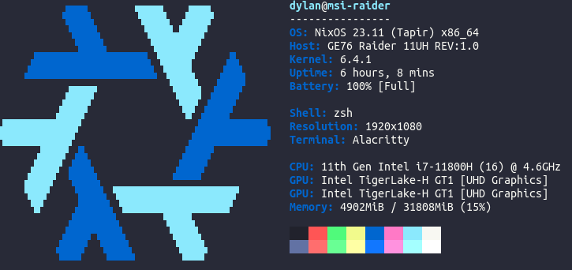

# Paleofetch for NixOS

## Description

Fork of [paleofetch-fedora](https://github.com/maciejlagowski/paleofetch-fedora) (which itself is a fork of [paleofetch](https://github.com/ss7m/paleofetch) that adds the fedora logo) adjusted to show the NixOS logo. The original paleofetch was itself a rewrite of [neofetch](https://github.com/dylanaraps/neofetch) in C.

Currently only supports Linux and Xorg.

So what the heck is it? It shows info like this:



But does it faster than neofetch, so you can safely put it at the end of you bashrc/zshrc

## Why use paleofetch over neofetch?

One major reason is the performance improvement. For example: neofetch finishes running after about 222 milliseconds where as paleofetch can finish running in a blazing fast 3 milliseconds.

Note: this testing occured on only 1 computer, it's not a good representation on the performance benefit you may gain.


## Compiling

### Dependencies

Paleofetch requires `libX11` and `libpci`. If you're running Xorg you should already have
the former. On Arch Linux, you should have `libpci` already installed if you have `pciutils`
installed. On other linux distrobutions, you may need to install libpci seperatley
if its not already present.

On NixOS, to build, you'll need a separate nix-shell with `pciutils` and `xorg.libX11`, but I'm assuming your system already has `make` and `gcc` at the top-level.

### Manual

```
nix-shell -p pciutils xorg.libX11
make
```

### Configuration

In your configuration.nix, add the following to the top just after the `{ config, pkgs, ... }` but before the next `{`:

```
{ config, pkgs, ... }:

let
    paleofetch = pkgs.stdenv.mkDerivation rec {
        name = "paleofetch";
        src = pkgs.fetchFromGitHub {
            owner = "blueOkiris";
            repo = "paleofetch-nixos";
            rev = "<latest github commit>";
            sha256 = "<result of 'nix-prefetch-url --unpack https://github.com/blueOkiris/paleofetch-nixos/archive/that-github-commit-from-above.tar.gz'>";
        };
        buildInputs = [ pkgs.gcc pkgs.gnumake pkgs.pciutils pkgs.xorg.libX11 ];
        buildPhase = ''
            mkdir -p $out
            cp -ra $src/* $out
            cd $out
            make
            rm -rf obj/
        '';
        installPhase = ''
            mkdir -p $out/bin
            cp $out/paleofetch $out/bin
        '';
    };
in {
    ...
}
```

## Usage

After compiling, simply run the executable: `./paleofetch`, or just `paleofetch` if installed on the system.

By default, `paleofetch` will cache certain  information (in `$XDG_CACHE_HOME/paleofetch`)
to speed up subsequent calls. To ignore the contents of the cache (and repopulate it), run `paleofetch --recache`

The cache file can safely be removed at any time, paleofetch will repopulate it
if it is absent.

